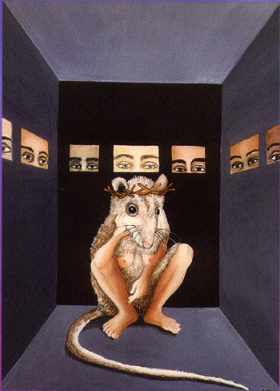

# Course Outline

#### Introduction

**Week 1**

Thursday, Sept 5: <em class="u">Course Introduction – “Why Look at Animals?"</em>

* Read: Berger, “Why Look at Animals?” from *About Looking* (1977), 1-28.

Further reading:
Cary Wolfe, "'Animal Studies', Disciplinarily, and the [Post]Humanities" in *What is Posthumanism?* (University of Minnesota Press, 2010), 99-126.

#### Unit 1: Categorizing

**Week 2**

Monday, Sept 9: <em class="u">Humans and Other Animals in the Enlightenment and Beyond</em>

Thursday, Sept 12 Reading:

*	Michel Foucault, *The Order of Things,* Chapter 5, “Classifying,” excerpts.
*	Vanessa Watts, "Indigenous place-thought & agency amongst humans and non-humans (First Woman and Sky Woman go on a European world tour!," *Decolonization: Indigeneity, Education & Society* 2 no. 1 (2013): 20-34.
* Zakiyyah Iman Jackson, "Animal: New Directions in the Theorization of Race and Posthumanism," *Feminist Studies* 39, no. 3 (2013): 669-685.
*	Primary source: Thomas Bewick, *A General History of Quadrupeds* (1790), excerpts.

**Week 3**

Monday, Sept 16: <em class="u">Species, Race, Science, Colonialism</em>

Thursday Sept 19 Reading:
*	Aimé Césaire, *Discourse on Colonialism* (1955), 65-78.
*	Micheal Banton, "The Idiom of Race: A critique of presentism," excerpts in *Theories of Race and Racism: A Reader,"* eds, Les Black and John Solomos (Routledge, 2009), 55-67.
*	Primary source: Darwin, "Variation Under Domestication," in *On the Origin of Species* (1859), excerpts.

**Week 4**

Monday Sept 23: <em class="u">Physiology and Vivisection – Darwinism and Imperialism</em>

Th Sept 26 Reading: 
* H.G. Wells, *The Island of Dr. Moreau* (1896) [whole book].
* "A physiological demonstration with vivisection of a dog." Oil painting by Emile-Edouard Mouchy (1832).

#### Unit 2: Breeding

**Week 5**

Monday, Sept 30: <em class="u">"The science of improving stock ... especially in man": Eugenics and Breeds of Empire</em>

Thursday, Oct 3 Reading:

* Margaret Derry, "Shorthorns and Animal Improvement," in *Bred for Perfection: Shorthorn Cattle, Collies, and Arabian Horses since 1800* (Hopkins Fulfillment Service, 2003), 17-42.
* Rebecca Woods, *The Herds Shot Round the World: Native Breeds and the British Empire 1800-1900* (University of North Carolina Press, 2017): Introduction, Ch 1 & 4.
* Francis Galton, *Inquiries Into Human Faculty and Its Development* (1833): 1-27.

**Week 6**

Monday, Oct 7: <em class="u">Totalitarianism, Biopower, Technoscience</em>

Thursday, Oct 10 Reading: 
* Tiago Saraiva, *Fascist Pigs: Technoscientific Organisms and the History of Facism* (MIT Press, 2016), Introduction, 1-16.
* Nicole Shukin, *Animal Capital: Rendering Life in Biopolitical Times* (Duke University Press, 2009), exerpts from Introduction, and Ch 3, "Telemobility: Telecommunication's Animal Currencies."
* Michel Foucault, *Society Must be Defended,* lecture at Collége de France (March 17, 1976), 239-263.

**Week 7**

Monday, Oct 14: <em class="u">Patenting "Model Organisms": Genetic Manipulation, Colonialism, Capitalism in the Laboratory</em>

Thursday, Oct 17 Reading:
* Evelyn Fox-Keller, *Century of the Gene* (Harvard University Press 2000), 1-10.
* Karen Rader, *Making Mice* (Princeton University Press, 2004), excerpts.
* Donna Haraway,"Mice into Wormholes: A Technoscience Fugue in Two Parts" in *Modest_Witness@Second_Millenium.FemaleMan Meets_OncoMouse* (Routledge, 1997), "Part 1: Kinship," excerpts.
* Primary source: [[insert p source OncoMouse pic]]

#### Unit 3: Backbreeding

**Week 8**

Monday, Oct 21: <em class="u">Conservation Biopolitics, Rewilding, De-Extinction</em>

Thursday, Oct 24 Reading: 
* Jamie Lorimer and Clemens Dresen, "From 'Nazi Cows' to Cosmopolitan 'Ecological Engineers': Specifying Rewilding Through a History of Heck Cattle," *Annals of the American Association of Geographers* 106 no. 3 (2016): 631-652.
* Elizabeth Hennessy, "Producing ‘prehistoric’ life: Conservation breeding and the remaking of wildlife genealogies" *Geoforum* 49 (2013): 71-80.

Primary sources:
* Peruse the Operation Taurus website: http://taurosprogramme.com/home/breeding-programme/
* And the Rewilding Project website: https://rewildingeurope.com/rewilding-in-action/wildlife-comeback/tauros/ 

Recommended watching: https://www.kimstim.com/film/genesis-2-0/ - A 2018 documentary on recent attempts to splice ancient Mammoth genes with Asian elephant to reintroduce mammoths for environmental conservation in Siberia.

**Week 9**

Monday, Oct 28: <em class="u">Heritage Breeds and Colonial Nostalgia</em>

**Mix n’ Match Primary Source/Theory Analysis due at beginning of class**

Thursday, Oct 31 Reading: 
* Scott Magelssen, "Resuscitating the Extinct: The Backbreeding of Historic Animals at U.S. Living History Museums," *TDR* 47, no. 4 (Winter, 2003): 98-109.
* Rodney Harrison, "On Heritage Ontologies: Rethinking the Material Worlds of Heritage," *Anthropological Quarterly; Washington* 91 no. 4 (Fall 2018): 1365-1383.
* Primary source: John Worrell, "How Do You Test History in a Lab?" *Rural Visitor,* XIX no. 1, (1974): 4-6.

#### Unit 4: Cloning

**Week 10**

Monday, Nov 4: <em class="u">Genetics, Identity, and Race at the End of the Twentieth Century</em>

Thursday, Nov 7 Reading:
* Kim Tallbear “Racial Science, Blood, and DNA," in *Native American DNA: Tribal belonging and the false promise of genetic science* (University of Minnesota Press, 2013), 31-66.
* Keith Wailoo, Alondra Nelson, Catherine Lee, *Genetics and the Unsettled Past: the Collision of DNA, Race, and History* (Rutgers University Press, 2012), Introduction.
* Donna Haraway, "RACE, Universal Donors in a Vampire Culture: It’s All in the Family. Biological Kinship Categories in the Twentieth-Century United States," in *Modest_Witness@Second_Millenium.FemaleMan Meets_OncoMouse* (Routledge, 1997), excerpts.

**Week 11**

Monday, Nov 11: LONG WEEKEND - NO CLASS

Th Nov 14 Reading:
* Sarah Franklin, *Dolly Mixtures: The Remaking of Genealogy* (Duke University Press, 2007) [whole book].

**Week 12**

Monday, Nov 18: <em class="u">*Jurassic Park* viewing party</em>

Thursday Nov 21 Reading: 
*	Svetlana Boym, "The Dinosaur: Nostalgia and Popular Culture," in *The Future of Nostalgia* (Basic Books, 2008).
* Laura Briggs and Jodi I. Kelber-Kaye, “There is no Unauthorized Breeding in Jurassic Park: Gender and the Uses of Genetics,” *National Womens' Studies Journal* 25, no. 1 (2002): 92-112.

#### Course Conclusion:

**Week 13**

Monday, Nov 25:  <em class="u">Animal Rights and the Liberal Self </em>

Thursday, Nov 28 Reading:
* Sue Donaldson and Will Kymlicka, *Zoopolis: A Political Theory of Animal Rights,* (Oxford University Press, 2011), excerpts. 
* Billy-Ray Belcourt, "Animal Bodies, Colonial Subjects: (Re)Locating Animality in Decolonial Thought," *Societies,* 5, no 1 (2015), 1-11.
* Paul Nadasdy, "First Nations, Citizenship and Animals, or Why Northern Indigenous People Might Not Want to Live in Zoopolis," *Canadian Journal of Political Science* 49, no. 1 (2016), 1-20.

Monday, December 2: “And Say the Animal Responded?”
* Read: Jacques Derrida, "The Animal that Therefore I am (More to Follow)," *Critical Inquiry* 28, no. 2 (2002), excerpts.

